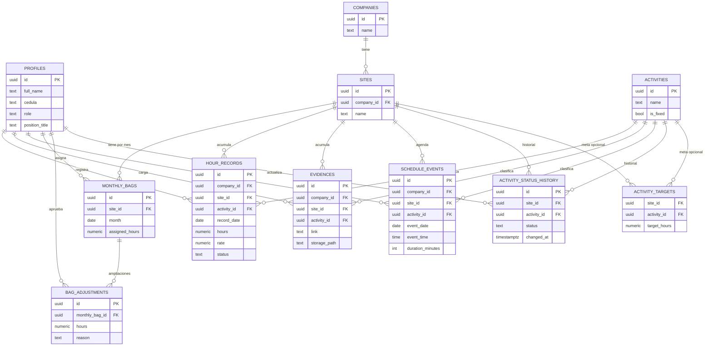

# Diagrama entidad-relación · SG-SST Control

## Cómo leerlo

Una empresa (`companies`) tiene varias sedes (`sites`); cada sede tiene, mes a mes, una bolsa de horas (`monthly_bags`) que puede recibir ampliaciones (`bag_adjustments`) y que se consume mediante registros de horas (`hour_records`). Cada registro de horas queda ligado siempre a una empresa, una sede y una actividad del catálogo global (`activities`, las 5 fijas del proyecto más cualquier otra que se agregue).

El estado de cada actividad **por sede** (Pendiente / En proceso / Completada) no se guarda como un solo campo que se sobreescribe: se guarda como un historial completo (`activity_status_history`), para que quede trazabilidad de cada cambio. El estado "actual" es simplemente el último registro de ese historial (vista `v_activity_current_status`).

`activity_targets` es opcional: solo existe si de verdad se definió una meta de horas para una actividad en una sede concreta. Si no existe, el progreso de esa actividad se muestra únicamente como horas acumuladas, nunca como un porcentaje inventado.

`evidences` y `schedule_events` también se agrupan por empresa/sede/actividad. `schedule_events` no permite dos filas que se crucen en el tiempo para la misma sede (restricción `EXCLUDE` a nivel de base de datos, además de la validación que ya hace el front-end antes de guardar).
